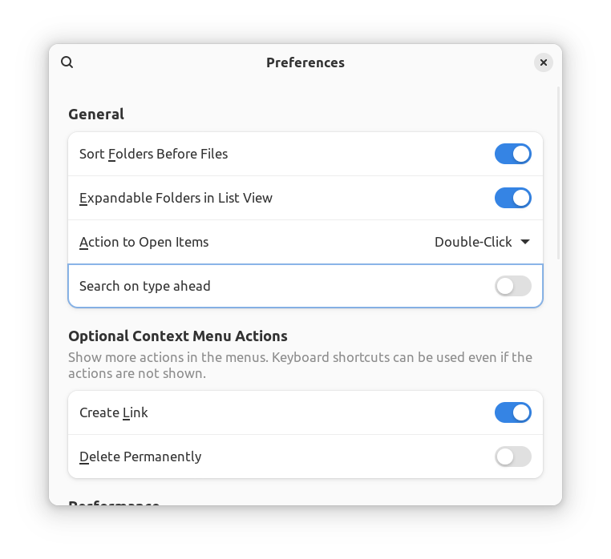

# fedora-nautilus-typeahead-rpm

Automatically builds a **GNOME Files** (**[Nautilus](https://apps.gnome.org/en/Nautilus/)**) RPM with type-ahead functionality for [Fedora Linux](https://fedoraproject.org/).

:sparkles: The resulting RPM is available for download under [Releases](https://github.com/nelsonaloysio/fedora-nautilus-typeahead-rpm/releases) for Fedora **39/40/41** (Workstation/Silverblue).

## Description

The default behavior on Nautilus nowadays is to type to search, i.e., to start a search when typing a character.
This package simply applies a pre-existing patch developed by the community to restore the type-ahead functionality,
i.e., browsing/navigating on key press, the default behavior on many file managers.

The new functionality may be toggled on the Preferences window (*Search on type ahead*):



## Install

### On Fedora Workstation

To install the package on Fedora Workstation, use the following command:

```bash
dnf swap nautilus ./nautilus-typeahead-*.rpm
```

This will replace one package with the other and avoid file conflicts.

### On Fedora Silverblue

To layer the package on Silverblue, use the following command:

```bash
rpm-ostree install --force-replacefiles ./nautilus-typeahead-*.rpm
```

The installed version will be replaced and type-ahead functionality will be enabled. **Restart** your machine in order to boot into the updated deployment.

## Building the RPM file

Simply run the script to install prerequisites with `dnf` and build Nautilus:

```bash
bash build-nautilus-typeahead-rpm.sh
```

**Note:** on Silverblue, run the command above inside a `toolbox` to avoid the need to layer the required dependencies on your base system.

A new file `nautilus-typeahead-*.rpm` will be created by the end of the process.

### Clean up dependencies

After building the RPM file, you may remove any installed dependencies with:

```bash
dnf history undo $(dnf history list --reverse | tail -n1 | cut -f1 -d\|)
```

The command above will undo the changes made on the last `dnf` execution.

___

## Notes

* :question: For more information on the issue, please check the [corresponding ticket](https://gitlab.gnome.org/Teams/Design/whiteboards/-/issues/142) (one of many) on GitLab.

* :heart: Thanks to all contributors responsible for developing and maintaining the type-ahead patch to restore this functionality to Nautilus!

### Contributors

* Contributor (original patch code): Jan de Groot <jgc@archlinux.org>
* Contributor (original package maintainer): Ian Hernández <badwolfie@archlinux.info>
* Contributor (updated Xavier's patch for 43.2): Bryan Lai <bryanlais@gmail.com>
* Contributor (updated Xavier's patch for 44.1): DragoonAethis <dragoon@dragonic.eu>
* Contributor (fix for backspace going to parent folder): Jeremy Bicha <jbicha@debian.org>
* Contributor (current patch code): Xavier Claessens <xavier.claessens@collabora.com>
* [AUR](https://aur.archlinux.org/cgit/aur.git/tree/PKGBUILD?h=nautilus-typeahead) maintainer: Albert Vaca Cintora <albertvaka@gmail.com>
* [PPA](https://github.com/lubomir-brindza/nautilus-typeahead) maintainer: Lubomir Brindza <lubomir@brindza.sk>
